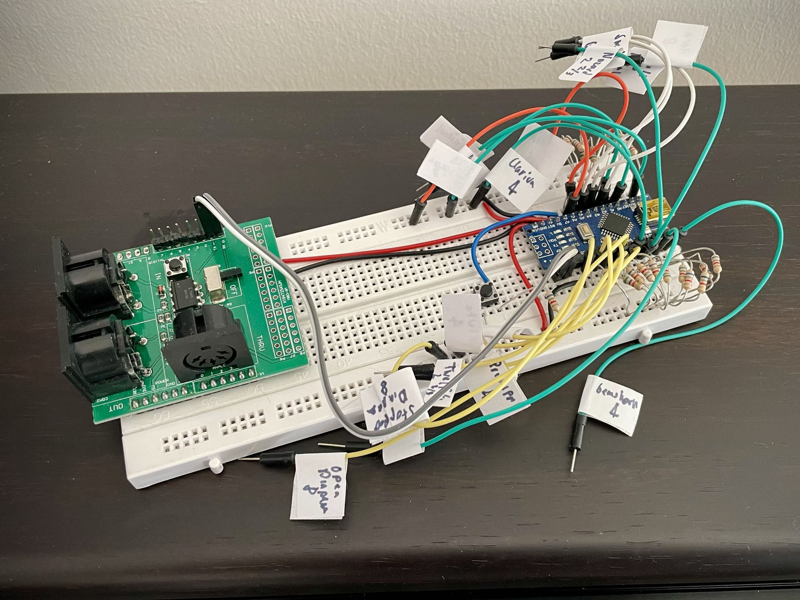

**@LenweSaralonde** on [GitHub](https://github.com/LenweSaralonde) / [YouTube](https://youtube.com/LenweSaralonde) / [Instagram](https://instagram.com/LenweSaralonde) / [Facebook](https://facebook.com/LenweSaralonde) / [TikTok](https://tiktok.com/@lenwesaralonde) / [Twitch](https://twitch.tv/LenweSaralonde) / [Twitter](https://twitter.com/LenweSaralonde) / [Bluesky](https://bsky.app/profile/lenwe.io) / <a rel="me" href="https://mastouille.fr/@LenweSaralonde">Mastodon</a>

**Table of contents**
* [Musician add-on for World of Warcraft](#musician-add-on-for-world-of-warcraft--musicianlenweio)
* [Adaptive controller for World of Warcraft](#adaptive-controller-for-world-of-warcraft)
* [Pipe organ console controller](#pipe-organ-console-controller)
* [8-port MIDI merger](#8-port-midi-merger)
* [Other add-ons for World of Warcraft](#other-add-ons-for-world-of-warcraft)

# Musician add-on for World of Warcraft – [musician.lenwe.io](https://musician.lenwe.io)

Musician is an UI add-on for *World of Warcraft* that provides music playing capability to the players. Unlike other popular MMORPGs such as *Lord of the Rings Online* or *Final Fantasy XIV*, *World of Warcraft* lacks a "bard class" or "music performance mode" which is highly appreciated by roleplayers. The goal of Musician is to fill this gap the best as possible using the limited features of the WoW UI API.

<iframe width="560" height="315" src="https://www.youtube.com/embed/HBCT-JKsoro" title="Musician video demo" frameborder="0" allow="accelerometer; autoplay; clipboard-write; encrypted-media; gyroscope; picture-in-picture" allowfullscreen></iframe>

The add-on consists in a rudimentary sample-based synthesizer of 24 instruments. These are mostly medieval and renaissance instruments to match WoW's medieval fantasy universe. More instruments can be added as plugins.

Music can be played from MIDI files, using the computer keyboard or a MIDI controller. The other players – who also have the add-on – and who are within range of the character can also listen to the music. Since add-ons have no control over the player's 3D avatar – for example to add an instrument model – the visual feedback is limited to animated notes showing above the player's nameplate. However, some standard in-game items and techniques can be used to improve the immersive experience.

## Project links
* Main add-on repository: [https://github.com/LenweSaralonde/Musician](https://github.com/LenweSaralonde/Musician)
* CurseForge add-on page: [https://www.curseforge.com/wow/addons/musician](https://www.curseforge.com/wow/addons/musician)
* Discord server: [https://discord.gg/ypfpGxK](https://discord.gg/ypfpGxK)
* Wiki: [https://github.com/LenweSaralonde/Musician/wiki](https://github.com/LenweSaralonde/Musician/wiki)
* GitHub project: [https://github.com/users/LenweSaralonde/projects/3](https://github.com/users/LenweSaralonde/projects/3)
* Project tools repository: [https://github.com/LenweSaralonde/MusicianTools](https://github.com/LenweSaralonde/MusicianTools)

## Plugins
In addition to the main main add-on and some plugins to provide additional features.
* **Musician Extended** ([GitHub](https://github.com/LenweSaralonde/MusicianExtended) / [CurseForge](https://www.curseforge.com/wow/addons/musicianextended)): Add more instruments to Musician.
* **Musician List** ([GitHub](https://github.com/LenweSaralonde/MusicianList) / [CurseForge](https://www.curseforge.com/wow/addons/musicianlist)): Save and load songs in-game.
* **Musician MIDI** ([GitHub](https://github.com/LenweSaralonde/MusicianMIDI) / [CurseForge](https://www.curseforge.com/wow/addons/musicianmidi)): Play live music using a MIDI keyboard.
* **Musician EZK** ([GitHub](https://github.com/LenweSaralonde/MusicianEZK) / [CurseForge](https://www.curseforge.com/wow/addons/musicianezk)): Play live using Guild Wars 2 simplified key bindings.

# Adaptive controller for World of Warcraft

The goal of this project was to make Romain, a World of Warcraft friend with severe disability, to regain control of the game so he could play again, despîte the evolution of his condition.

The core of the project is a [Makey Makey](https://makeymakey.com/) card, a cheap and fun toy that can turn almost any conductive object into a standard PC keyboard and mouse input. Using salvaged wires, tape, zip ties and some freeware such as [AutoHotKey](https://www.autohotkey.com/) and custom scripts, we managed to give him back full control to the game.

More information in the video description. Enable CC for english subtitles.

<iframe width="560" height="315" src="https://www.youtube.com/embed/KrIIDFBODwA" title="Adaptive controller for World of Warcraft video" frameborder="0" allow="accelerometer; autoplay; clipboard-write; encrypted-media; gyroscope; picture-in-picture" allowfullscreen></iframe>

# Pipe organ console controller

[Joan's pipe organ](https://www.lookmumnocomputer.com/joans-church-organ) is a 100 year old church organ salvaged by musician, maker and youtuber Sam Battle a.k.a [LOOK MUM NO COMPUTER](https://www.youtube.com/LOOKMUMNOCOMPUTER).

The project consists in replacing the old electromechanical controls made of thousands of wires and relays by MIDI using modern off-the-shelf components.

The organ console, that consists of 2 manuals (keyboards), a pedalboard, 16 stops and a presets board, was converted by Sam into a MIDI controller, powered by an Arduino Nano board. It controls 4 rows of pipes (principal, string, flute and reed), each of one of them having their own MIDI channel.

This code addresses several issues encountered by Sam such as concurrent MIDI messages resulting in the combination of certain key and stops configuration and buffer overruns when complex songs are played on the organ.

The process was to first test the code on an emulator then on a test rig using my 2 MIDI keyboards and my computer to emulate the organ pipes, then send it to Sam on Patreon where he then posted the result on video.

The whole process has been documented in the part 15 of his video series about the Joan's pipe organ restoration project.

<iframe width="560" height="315" src="https://www.youtube.com/embed/HzKAckJEd_8?list=PLluPQLh1xzlI7EMB5qIxDd_1OLE-Z_kyC&index=16&si=QullWxJ_QEEneK4u&t=93" title="100 year old church organs had programmable presets! I BOUGHT A CHURCH ORGAN - part 15" frameborder="0" allow="accelerometer; autoplay; clipboard-write; encrypted-media; gyroscope; picture-in-picture" allowfullscreen></iframe>

* GitHub repository: [https://github.com/LenweSaralonde/LMNC-organ-console](https://github.com/LenweSaralonde/LMNC-organ-console)

# 8-port MIDI merger

Very simple open source low cost DIY MIDI merger that allows to connect up to 8 MIDI controllers to a single instrument. It was initially designed for [LOOK MUM NO COMPUTER](https://www.youtube.com/LOOKMUMNOCOMPUTER)'s pipe organ project and serves as an alternative to commercial products that are usually very expensive and can't receive software updates.

It's made of a Raspberry Pi Pico and a few off-the-shelf components. The code is written in C++.

* GitHub repository: [https://github.com/LenweSaralonde/pico-midi-merger](https://github.com/LenweSaralonde/pico-midi-merger)

# Other add-ons for World of Warcraft

## Story Teller

Story Teller is designed to tell long stories for roleplaying, including emotes and macros. Can be used in combination with [Musician](#musician--musicianlenweio) for song lyrics.

* GitHub repository: [https://github.com/LenweSaralonde/StoryTeller](https://github.com/LenweSaralonde/StoryTeller)
* CurseForge add-on page: [https://www.curseforge.com/wow/addons/story-teller](https://www.curseforge.com/wow/addons/story-teller)

## TripleScreen

Simple add-on to play WoW on 3 monitors.

* GitHub repository: [https://github.com/LenweSaralonde/TripleScreen](https://github.com/LenweSaralonde/TripleScreen)
* CurseForge add-on page: [https://www.curseforge.com/wow/addons/triplescreen](https://www.curseforge.com/wow/addons/triplescreen)
